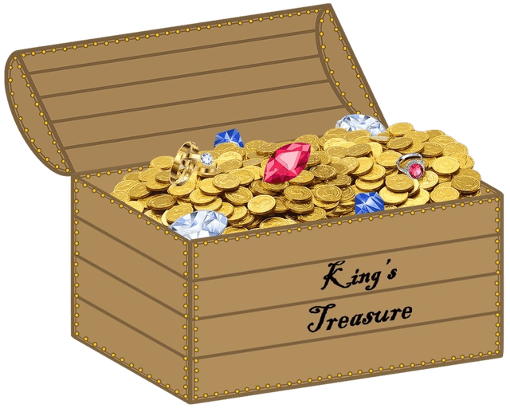
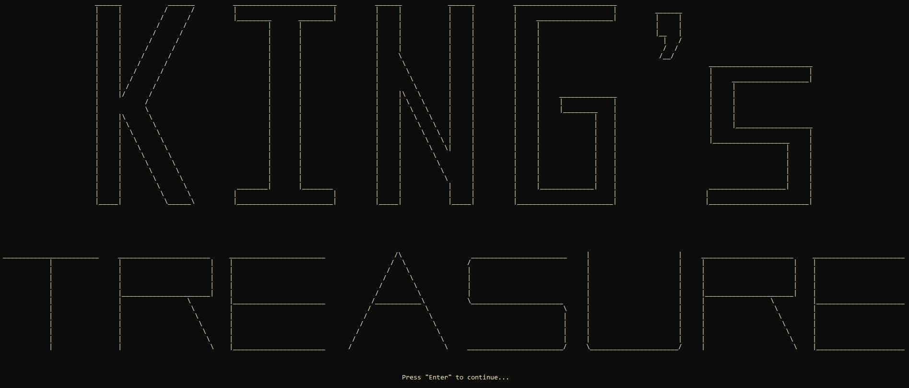
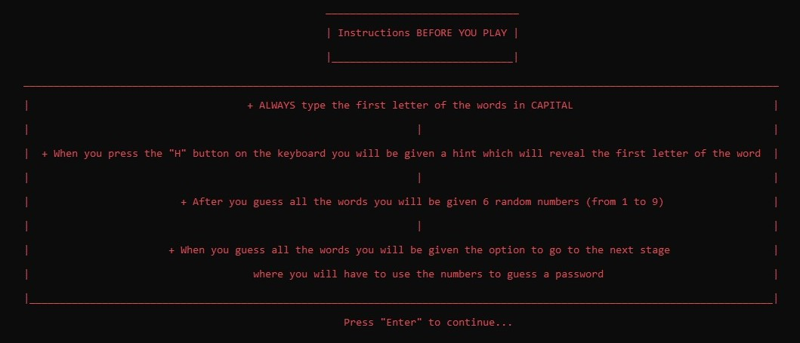

# King's Treasure

## 🎮 About the Game

You have to guess 6 words from a given description.
After you guess all the words you will be given 6 random numbers.
In the second part of the game you will have to put them in the described order.

## Used Languages

## Used Programmes

## Screenshots

## ✨ About US
We are young developers from Burgas, Bulgaria.
We study at PGKPI.
And this is our first project.

## 🔗 Links

